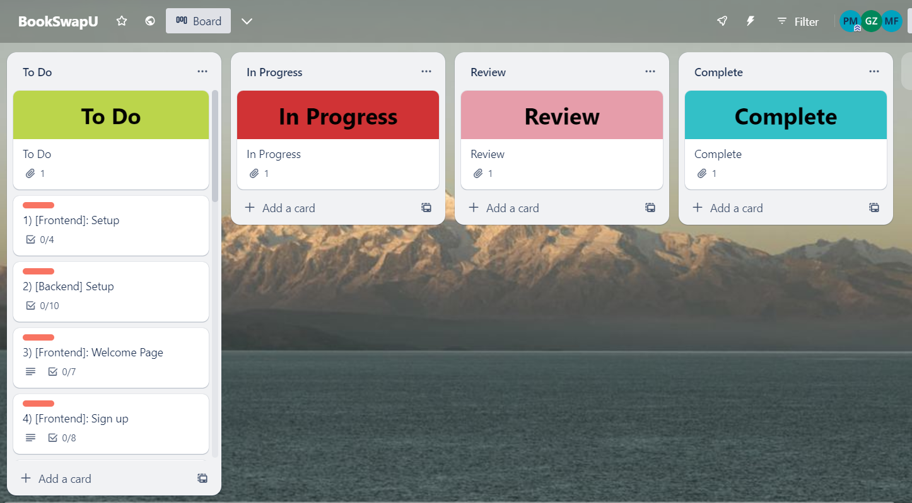

# PhillipMiguelMarkovic_T3A1 Full Stack Application (Part A): Book Exchange Application

# R1. Description of the Website

## Purpose

Our project aims to develop a comprehensive textbook exchange platform that enables students at the University of Technology, Sydney (UTS) to efficiently exchange textbooks with one another. This platform empowers students to manage their textbook needs independently, eliminating the need for university intervention. The system can be scaled for use by all universities in Sydney, across Australia, and potentially extended to the general public. The platform will facilitate user registration, book management, inventory tracking, search capabilities, and notifications for seamless book swapping.

Some of the benefits of this approach become immediately obvious.

**Student Empowerment** - Students gain autonomy and control over their textbook needs, streamlining the exchange process.

**Cost Savings** - The platform promotes financial savings by enabling students to exchange textbooks instead of purchasing new ones.

**Sustainability and Environmental Impact** - Encourages sustainable practices by reducing the demand for new textbooks and minimizing waste.

**Enhanced Collaboration** - Facilitates collaboration and interaction between students across different universities.

## Functionality and Features

**User Registration and Authentication**

* Students can register using their university email or a standard sign-up process.
Secure authentication mechanisms will ensure the privacy and security of user accounts.

* Users can create and manage their profiles, including contact information and university details.

**Book Management**

* Registered users can add, update, and delete books from their inventory.

* Book details, such as title, author, edition, condition, and ISBN, will be stored in the system.

**Inventory Tracking**

* Each user maintains an inventory of available books they are willing to exchange.

* Inventory entries include book information, availability status, and condition details.

**Search Functionality**

* Users can search for books based on title, author, or other relevant criteria.

* A the search function will return a list of users who possess the desired books.

**Listing of Users with Desired Books**

* When a user searches for specific books, the platform will display a list of users who have those books in their inventory.

**Communication and Notifications**

* Users can communicate directly with other users who have the desired books for exchange.

* The platform enables messaging features to facilitate book swapping discussions.

* Users will receive notifications through the system to stay informed about new messages and potential exchange opportunities.

## Target Audience

The proposed book exchange web application is targeted primarily towards university students, with the initial focus on UTS university students and later expanding to other universities in Sydney, the rest of Australia, and potentially to the general public. The target audience can be further broken down into the following categories:

* **University Students:** The primary target audience comprises university students from UTS and other universities in Sydney and Australia. These students are seeking an efficient and convenient way to exchange textbooks with their peers. They are tech-savvy and comfortable with using web applications for various purposes.

* **Textbook Owners:** Students who own textbooks they no longer need are a specific subset of the target audience. They are interested in making their textbooks available for exchange and may be looking for specific textbooks they need for their courses.

* **Textbook Seekers:** Students actively seeking specific textbooks for their courses are another key audience. They want to find textbooks they need without having to purchase them, and the application provides a platform for them to search for these books among their peers.

* **University Community:** As the application extends its reach to other universities and potentially the general public, the target audience expands to include students, faculty, and staff members from various universities, as well as individuals who are looking for a platform to exchange books.

* **Book Enthusiasts:** Individuals who have an interest in reading beyond their academic studies can also benefit from the application. They might want to explore and exchange books on various topics with other users.

* **Administrators and Moderators:** While not the primary users, administrators and moderators of the application are also part of the target audience. They are responsible for maintaining the platform, ensuring its smooth operation, and addressing any issues or disputes that arise.

The application aims to serve a diverse group of users, ranging from university students in need of textbooks for their courses to those who want to make their unused textbooks available for exchange. By catering to these different user needs, the application seeks to create a vibrant community of book exchange enthusiasts and facilitate seamless textbook swapping among students within universities and beyond.

## Technology Stack

The proposed book exchange web application will be developed using the MERN technology stack, which stands for MongoDB, Express.js, React.js, and Node.js. Each component of the stack serves a specific purpose and contributes to the overall functionality and user experience of the application.

### MongoDB (Database)

MongoDB is a NoSQL database that provides a flexible and scalable data storage solution. In the context of the book exchange application, MongoDB will be used to store information related to users, books, users' inventories, and comments. Collections for users, books, inventory items, and comments can be defined to organize and store the data efficiently. MongoDB's document-based structure allows for easy storage and retrieval of complex data structures, making it suitable for storing user profiles, book details, and inventory information.

### Express.js (Backend Framework)

Express.js is a web application framework for Node.js that simplifies the process of building server-side applications. It provides a set of tools and utilities for creating routes, handling requests and responses, and managing middleware. In the book exchange application, Express.js will be used to create APIs for user authentication, book management, search functionality, and inventory management. It will handle the communication between the frontend and the database, as well as manage the business logic of the application.

### React.js (Frontend Library)

React.js is a JavaScript library for building user interfaces. It allows for the creation of dynamic and interactive frontend components. In the book exchange application, React.js will be used to develop the user interface, including pages for user registration and login, book listing, search results, user inventory management, and notification display. React's component-based architecture enables the development of reusable UI components that enhance the user experience.

### Node.js (Runtime Environment)

Node.js is a runtime environment that allows JavaScript to be executed on the server side. It provides a non-blocking, event-driven architecture, making it efficient for handling multiple concurrent connections. Node.js will be used as the backend runtime environment for the book exchange application. It will run the Express.js server, handle API requests, and interact with the MongoDB database.

### Additional Libraries and Tools

* **JWT (JSON Web Tokens):** JWT will be used for user authentication and authorization. It allows the application to generate and verify secure tokens for users, ensuring a secure session.

* **Bcrypt:** The BCrypt library lets you hash and salt plaintext passwords in Node.js which are then stored in the database. The frontend would also use bycrypt to encode a submitted plaintext password, and then send it on to the server.

* **ViTest, Jest and Supertest:** Vitest is the unit testing framework built on top of Vite. It is used to test componenents in React. Supertest is a Node.js library and when used together with Jest, allows developers and testers to write automated tests for routes and endpoints.

# R2. Dataflow Diagram

# R3. Application Architecture Diagram

# R4. User Stories

These user stories cover the main functionality of the Book Exchange Application. They can serve as a starting point for designing and implementing the respective features of a full stack MERN application. It is from these stories that the tasks specified in my Trello board (R6) are derived.

**User Account Management:**

* As a user, I want to create an account (sign-up) using my university email to access the textbook exchange platform.

* As a user, I want to log in securely using my credentials to manage my textbook inventory.

* As a user, I want the option to reset my password in case I forget it.

**Book Management:**

* As a user, I want to add new textbooks to my inventory, providing details like title, author, edition, and condition.

* As a user, I want to update the details of the books in my inventory, such as condition and availability status.

* As a user, I want to remove books from my inventory that I no longer wish to exchange.

**Search and Discovery:**

* As a student, I want to search for specific textbooks by entering the title or author's name.

* As a user, I want to view a list of users who possess the textbooks I am looking for.

* As a user, I want to see the availability status and condition of the textbooks in the search results.

**Book Exchange Request:**

* As a user, I want to send direct request to other users who have the textbooks I want to exchange.

* As a user, I want to receive a notification (accept/decline) through the platform from other students with whom I have requested an exchange.

* As a user, I want to be notified (request) through the platform when another user wants to exchange books from my inventory.

**Book Exchange Process:**

* As a user, I want to initiate a book exchange by proposing a swap to another user.

* As a user, I want to accept or reject a proposed book exchange offer from another student.

* As a user, I want to view the confirmed book exchange details, including the books being swapped and contact information.

**User Feedback and Ratings (Comments):**

* As a user, I want to provide feedback and ratings about the platform.

* As a student, I want to view the ratings and feedback provided by other users.

**System Notifications:**

* As a user, I want to receive system notifications about important updates, such as changes in exchange status or new messages.

* As a student, I want to receive reminders about upcoming book exchange appointments.

**Administration and Moderation:**

* As an administrator, I want to manage user accounts and ensure the platform remains safe and functional.

* As an administrator, I want to review and address any reported issues or disputes between users.

These user stories outline the various features and functionalities of the proposed textbook exchange web application. Each user story addresses specific needs and requirements of both students and administrators, ensuring a comprehensive and user-centric experience for all parties involved in the book exchange process.

# R5. Wireframe Diagrams

# R6. Trello Board

## Link to Trello Workspace

https://trello.com/b/EmuuACLM/bookswapu

